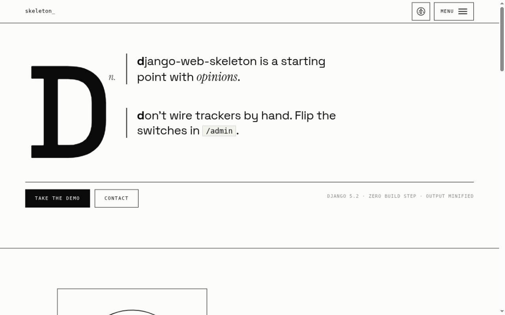
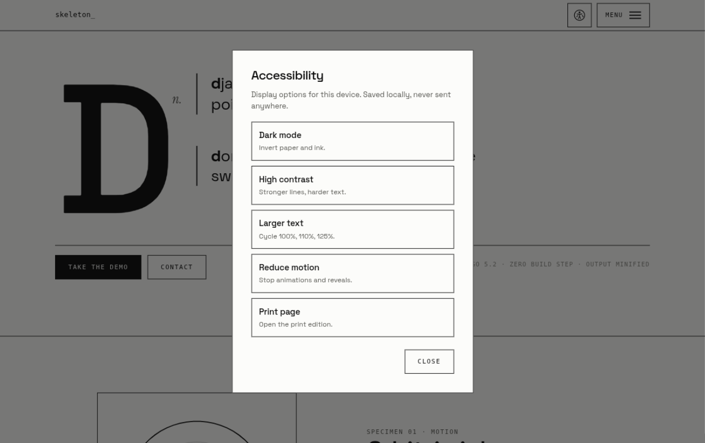
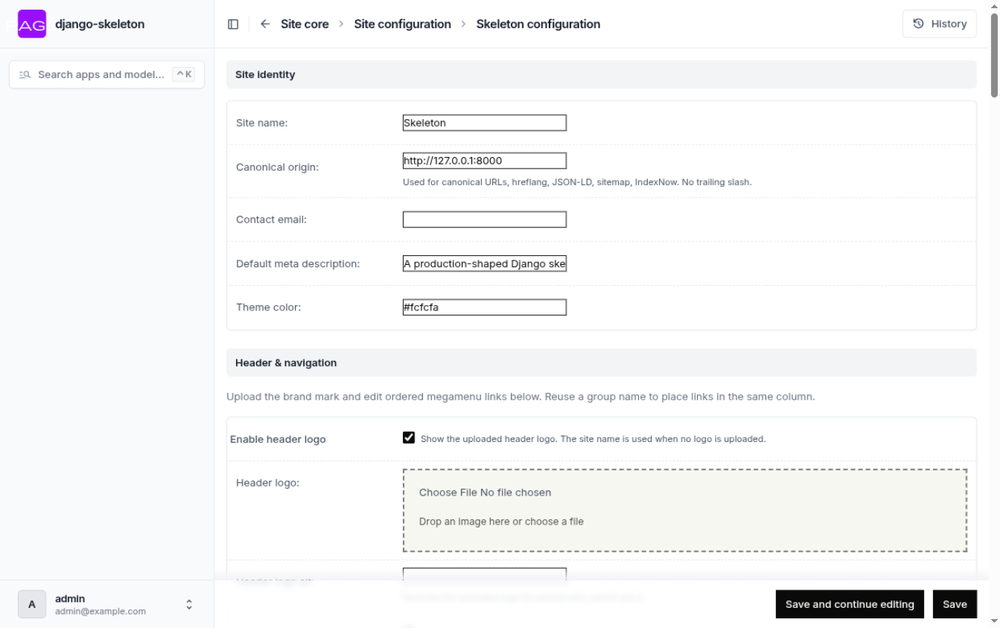
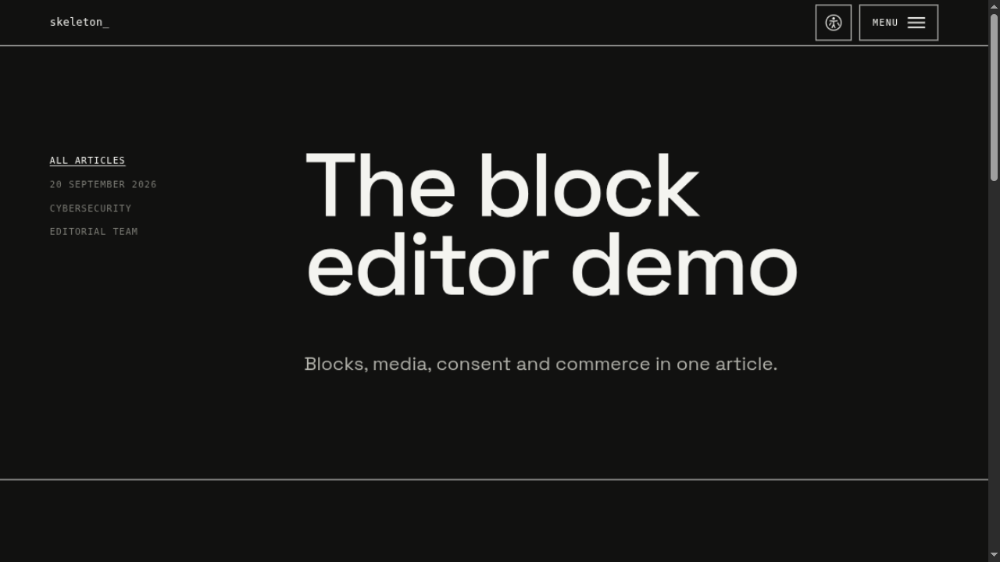
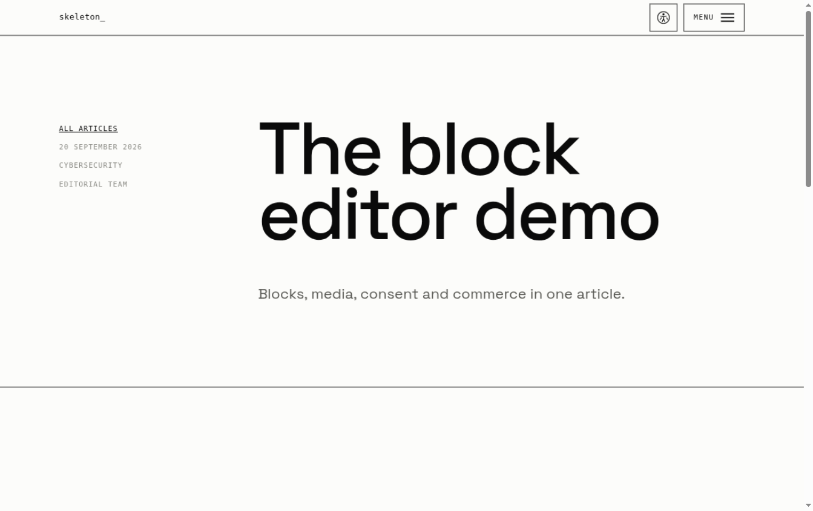
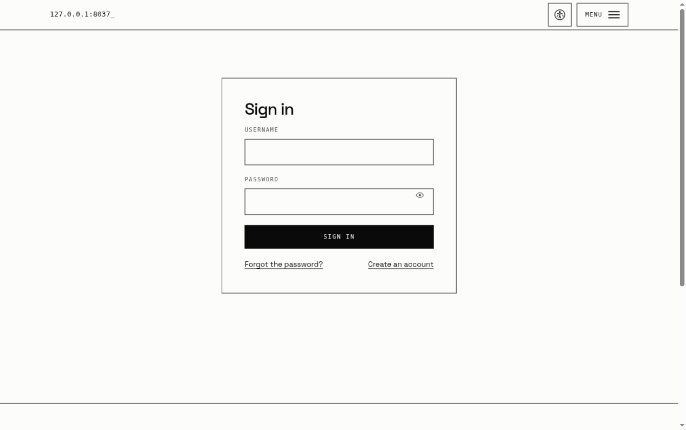

# django-web-skeleton

A switchboard for Django sites. It ships the repetitive parts once, then lets the admin decide what stays visible.

## Start

```bash
python -m venv .venv
source .venv/bin/activate
pip install -r requirements.txt
python manage.py migrate
python manage.py runserver
```

Open `http://127.0.0.1:8000/admin/`:

```text
username: admin
password: b_4sIcPW007
```

The first migration creates that superuser if it does not exist. Set `SEED_ADMIN_USERNAME`, `SEED_ADMIN_PASSWORD`, and `SEED_ADMIN_EMAIL` in `.env` to change the defaults. Never expose the starter password to the internet.

## A quick gallery

| | |
|---|---|
|  |  |
| _Index: one big letter, blocks, consent everywhere._ | _Accessibility options, one button in the header._ |
|  |  |
| _Admin: grouped sidebar instead of an app dump._ | _The control panel: IDs, switches, retention, everything._ |
|  |  |
| _Article blocks with drag-and-drop ordering._ | _External media stays a placeholder until consent._ |
|  | |
| _Login and registration with password eye toggles._ | |

## The control panel

- Articles have publishing, SEO, attribution, disclosures, hero images, Open Graph images, and drag-and-drop inline images.
- Robots rules accept paths and prefixes. `/static/` covers everything below it. Legal, contact, account, admin, static, media, API, and fragment paths are blocked by default.
- Footer sections hold ordered links, actions, text, and logos. Automatic links disappear when their feature is off.
- The header logo and grouped megamenu are editable inside Site configuration, with a large mobile burger menu built in.
- Consent, tracking, contact, registration, sitemap, robots, AI files, articles, embeds, and middleware each have switches.

Disabled means absent: no public route, navigation link, footer entry, sitemap entry, or AI page-list entry.

## Change the template

Open the repository with a coding agent and type:

```text
init the template
```

Read [AGENTS.md](AGENTS.md) before manual changes. The page-building map is in
[docs/PAGE-BUILDING.md](docs/PAGE-BUILDING.md). Footer content is data. Do not
hardcode footer columns or links in templates.

This skeleton removes routine setup, but it is not perfect and still needs a careful review for each project.

## Check before shipping

```bash
python manage.py test
python manage.py collectstatic --noinput
```

The legal pages are starters, not legal advice. Replace every placeholder and review the finished site for your jurisdiction and data processing.
