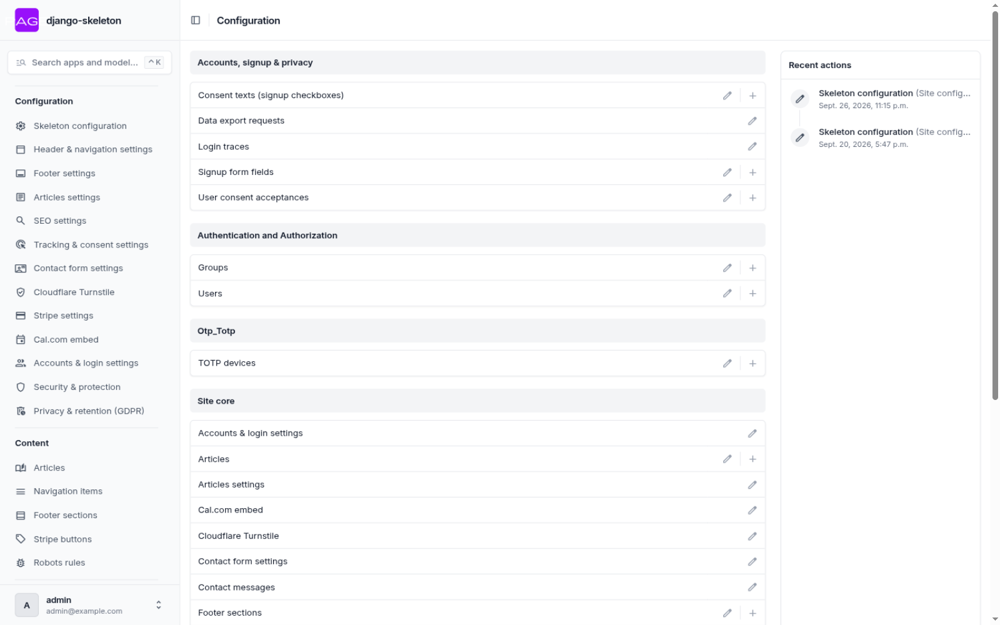
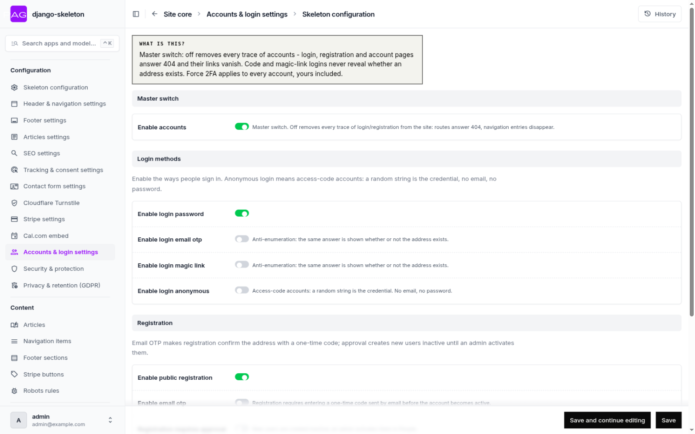
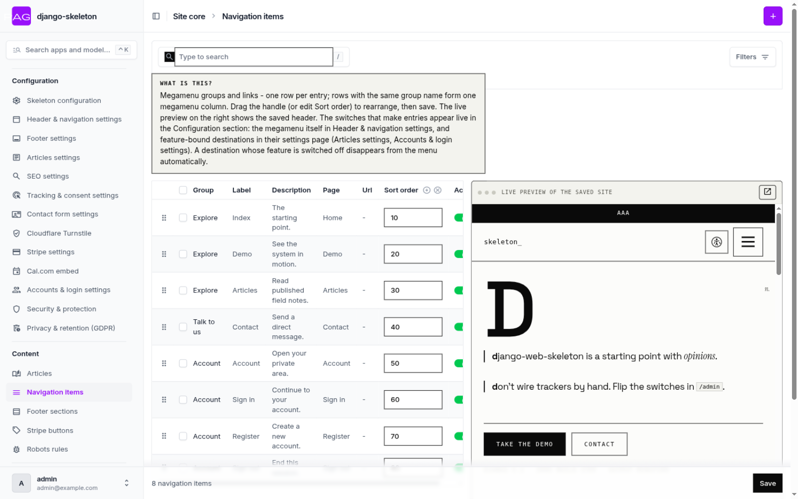
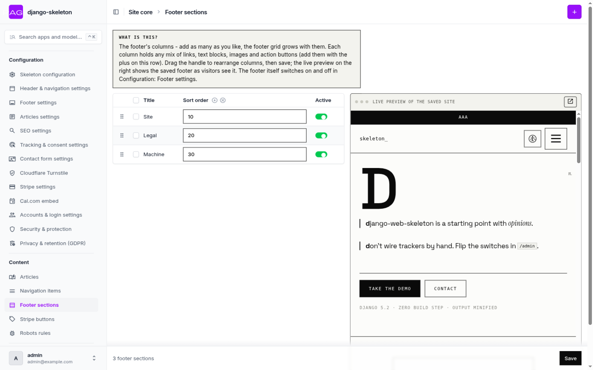
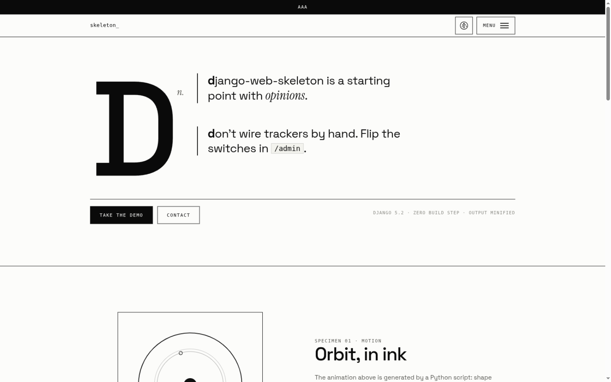
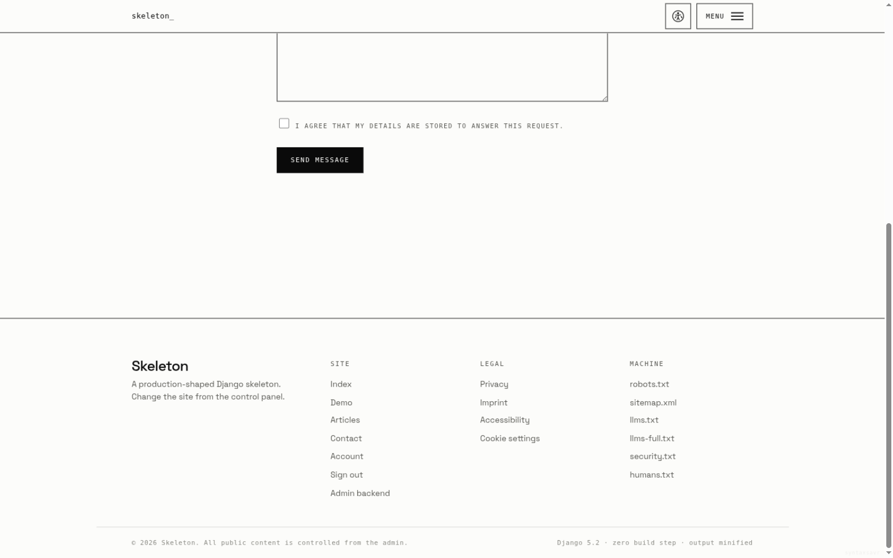

# django-web-skeleton

A switchboard for Django sites. It ships the repetitive parts once, then lets the admin decide what stays visible — and lets coding agents work on it without breaking it.

## Start

```bash
python -m venv .venv
source .venv/bin/activate
pip install -r requirements.txt
python manage.py migrate
python manage.py runserver
```

Open `http://127.0.0.1:8000/admin/`. The development seed (`manage.py seed`
or the first migration in DEBUG mode) creates the superuser from
`SEED_ADMIN_USERNAME` / `SEED_ADMIN_PASSWORD` in your `.env` - set your own
values before the first run. In production the seed never runs: create the
admin with `python manage.py createsuperuser`, and the server refuses to
boot while `SEED_ADMIN_PASSWORD` is unset or still the published default.

The first migration creates that superuser if it does not exist. Set `SEED_ADMIN_USERNAME`, `SEED_ADMIN_PASSWORD`, and `SEED_ADMIN_EMAIL` in `.env` to change the defaults. Never expose the starter password to the internet.

## A quick gallery

Click any picture to explore it full size.

| | |
|---|---|
| [](docs/images/admin-dashboard.png) | [](docs/images/admin-settings-page.png) |
| _The admin menu: every on/off lives under **Configuration**, one page per domain. Content rows live under **Content**._ | _Every settings page explains itself in a banner and leads with its master switch - accounts, in this case._ |
| [](docs/images/admin-navigation-preview.png) | [](docs/images/admin-footer-preview.png) |
| _Megamenu links and footer columns: drag the handle to reorder, see the saved site in the live preview pane._ | _The footer grows with your columns - links, text blocks, images and action buttons per column._ |
| [](docs/images/public-homepage.png) | [](docs/images/public-footer-grid.png) |
| _The public site: one big letter, lazy sections, consent everywhere._ | _Footer as a data-driven grid: brand column plus any number of sections._ |

More pictures live in [docs/images](docs/images). The article block editor and the consent-gated media placeholders are shown on the Demo page and in [docs/DESIGN-SYSTEM.md](docs/DESIGN-SYSTEM.md).

## What is done here

- **One control panel, focused pages.** A single `SiteConfiguration` row is presented as thirteen settings pages (Skeleton configuration, Articles, SEO, Tracking & consent, Cloudflare Turnstile, Stripe, Cal.com, Accounts & login, Security & protection, Privacy & retention...). Saving one page writes only that page's fields.
- **Feature switches, not forks.** Articles, contact form, consent, tracking, registration, sitemap, robots.txt, llms.txt, IndexNow, embeds and middleware layers each have a runtime switch. Disabled means absent: routes answer 404 and every link, sitemap entry and AI page-list entry disappears with them.
- **Editorial system.** Articles built from ordered blocks (heading, text, quote, image, video, Stripe buy button, divider), hero and OG images, WebP conversion, disclosure flags, preview of the unsaved editor state.
- **Navigation and footer are data.** Megamenu groups and footer columns are rows - links, text, images, action buttons - never hardcoded in templates. Both support drag-and-drop ordering and render a live preview of the saved site right next to the row list.
- **Consent before measurement.** A tracker loads only when the master switch is on, the visitor consents, and its ID exists. External media stays a placeholder until consent.
- **Accounts with opinions.** Four login methods (password, email code, magic link, anonymous access codes), optional registration approval, forced 2FA - code and magic-link logins never reveal whether an address exists.
- **Privacy with friction by design.** Contact messages and login traces auto-delete; data exports wait out a delay, stay downloadable for a window, then a cooldown applies before the next request.
- **Defenses included.** Honeypot, signed time-trap, per-session rate limit, Cloudflare Turnstile (fail closed), scraper blocking, CSP with dynamic host extension, and a noindex kill switch for staging.
- **SEO and AI surfaces.** Sitemap, robots rules, llms.txt / llms-full.txt, JSON-LD, IndexNow, verification meta tags - each individually switchable.

## The thinking inside

- **Switches, not code changes.** Anything a client may want to turn off at runtime is a switch in the admin, never a deployed change. Anything security-relevant stays human-only and is deliberately not agent-editable.
- **One row, many windows.** All settings live in one database row; the admin shows it as as many small pages as needed. Clarity in the UI, simplicity in the schema.
- **The page explains itself.** Every list and every settings page carries a short "What is this?" text: what it is for, when you touch it, what switching off removes. An admin (or an agent) never has to guess.
- **Show, don't describe.** Wherever rows map to something visual - megamenu, footer - the admin renders the saved site next to the table instead of making you imagine it.
- **Secrets stay out of the database.** Keys with real power (SMTP, Turnstile, signing) come from the environment; environment overrides always win over admin values.
- **Errors tell nothing.** Production renders every error as the same generic 404 with random padding, so probing reveals neither existence nor permissions.

## AI-ready

This repository is built to be worked on by coding agents, not just humans:

- **[AGENTS.md](AGENTS.md) is the operating manual.** Architecture map, change routing ("what to change where"), security invariants, middleware ordering, recipes for pages, navigation, footer, trackers and robots rules - written so an agent reads the contract before writing code.
- **The admin documents itself to agents.** The in-admin "How to change things" page routes every kind of request to the right channel (admin row vs. code vs. `.env` vs. ops file).
- **Signed ops files for autonomous changes.** An agent with no human present can only change the world through signed JSON files in `ops/pending/`: allow-listed content config and `ai_`-prefixed tables, 24h TTL, every file logged to the Ops log.
- **Tests are the contract.** 150 tests assert every switch in both states ("disabled means absent"), the settings-page isolation, the contact defenses and the seed idempotency. `python manage.py test` is the definition of "still works".
- **Runbooks, not tribal knowledge.** [HEY-READ-THIS-FIRST.md](HEY-READ-THIS-FIRST.md) is the one-time initialisation interview, [docs/PAGE-BUILDING.md](docs/PAGE-BUILDING.md) the page contract, [docs/NAVIGATION.md](docs/NAVIGATION.md) the header contract.

## Change the template

Open the repository with a coding agent and type:

```text
init the template
```

Read [AGENTS.md](AGENTS.md) before manual changes. The page-building map is in
[docs/PAGE-BUILDING.md](docs/PAGE-BUILDING.md). Footer content is data. Do not
hardcode footer columns or links in templates.

This skeleton removes routine setup, but it is not perfect and still needs a careful review for each project.

## Check before shipping

```bash
python manage.py test
python manage.py collectstatic --noinput
```

The legal pages are starters, not legal advice. Replace every placeholder and review the finished site for your jurisdiction and data processing.
